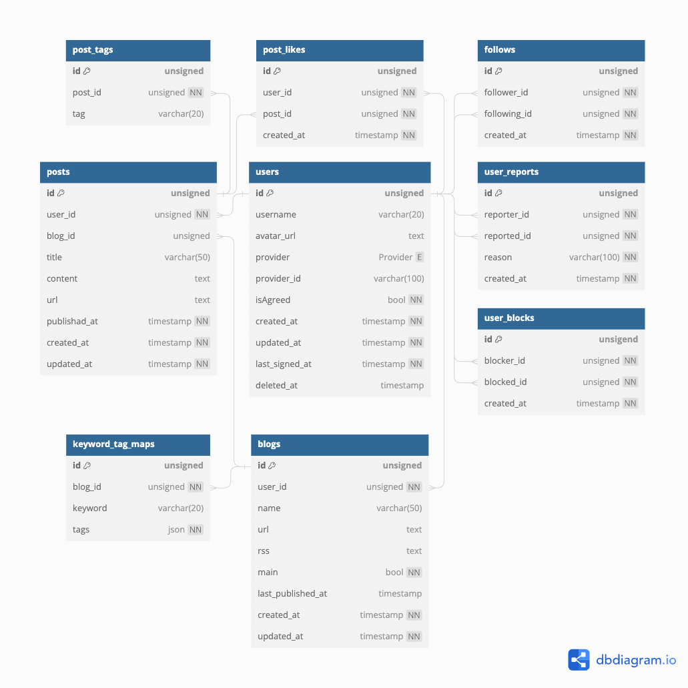
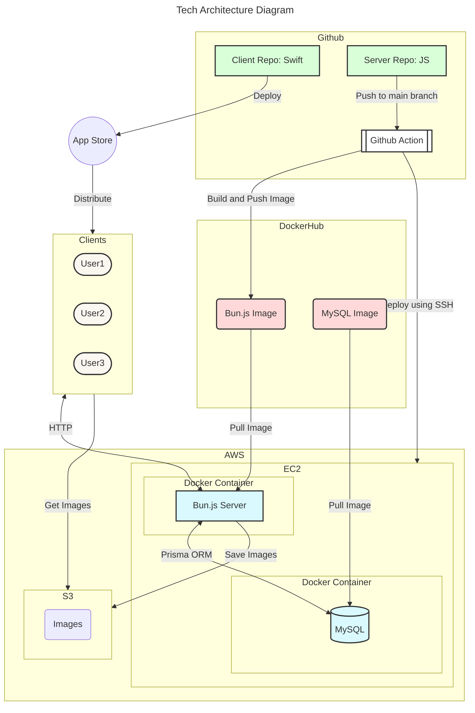

# 티로그 API Server

[API Documentation (Postman)](https://documenter.getpostman.com/view/30710555/2s9YXiZh7j)

## Development

### Getting Started

Clone the repository:

```bash
$ git clone https://github.com/nbcamp/tlog-api.git
$ cd tlog-api
```

Install dependencies(using [Bun](https://bun.sh)):

```bash
$ bun install
```

Start the server:

```bash
$ bun run start:dev
```

### Environment Variables

Set environment variables in `.env` file:

```bash
$ cp .env.example .env
```

For more information, see [`.env.example`](./.env.example).

### Scripts

```bash
# Start the server in development mode
$ bun run start:dev

# Migrate database
$ bun run migrate:dev

# Update packages
$ bun run update

# Lint code
$ bun run lint

# Check types
$ bun run tsc
```

---

## [Database Schema](https://dbdiagram.io/d/티로그-6526132fffbf5169f071fe0c)



## Features

- Restful API
- Postman Documentation
- FileSystem-Based API Routing
- Body(JSON) Validation

## Architecture


